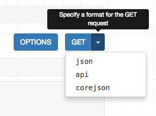

# Tutorial 7: Schemas & client libraries

模式和客户端库

A schema is a machine-readable document that describes the available API endpoints, their URLS, and what operations they support.

模式是一个机器可读文档，用来描述可用的API入口、它们的URL以及它们支持的操作。

Schemas can be a useful tool for auto-generated documentation, and can also be used to drive dynamic client libraries that can interact with the API.

模式可以成为自动生成文档的有用工具，也可用于驱动可与API交互的动态客户端库。

## Core API

In order to provide schema support REST framework uses [Core API][coreapi].

REST framework 使用[Core API][coreapi]提供模式支持。

Core API is a document specification for describing APIs. It is used to provide an internal representation format of the available endpoints and possible interactions that an API exposes. It can either be used server-side, or client-side.

Core API 是用于描述APIs的文档规范。

它用于提供可用入口的内部表示形式以及API暴露出来的交互模式。

它可以用在服务器端或者客户端。

When used server-side, Core API allows an API to support rendering to a wide range of schema or hypermedia formats.

在服务器端使用时，Core API 允许API支持以各种架构或者超媒体格式进行渲染。

When used client-side, Core API allows for dynamically driven client libraries that can interact with any API that exposes a supported schema or hypermedia format.

在客户端使用时，Core API 一些动态驱动的客户端库，而这些客户端库必须是能够与暴露出交互模式或者超媒体格式的API进行交互的。

## Adding a schema

尝试添加一个模式

REST framework supports either explicitly defined schema views, or automatically generated schemas. Since we're using viewsets and routers, we can simply use the automatic schema generation.

REST框架支持显式定义的模式视图或自动生成的模式。

一旦我们使用viewsets和routers后，我们能够轻而易举的自动生成模式。

You'll need to install the `coreapi` python package in order to include an API schema.

为了生成API模式，你需要安装一个`coreapi`的Python包。

    $ pip install coreapi
We can now include a schema for our API, by including an autogenerated schema view in our URL configuration.

现在，我们就可以为我们的API生成一个模式了，只需要在URL配置中配置自动生成模式view。 

```python
from rest_framework.schemas import get_schema_view

schema_view = get_schema_view(title='Pastebin API')

urlpatterns = [
    url(r'^schema/$', schema_view),
    ...
]
```

If you visit the API root endpoint in a browser you should now see `corejson` representation become available as an option.

如果你在浏览器中访问API根入口，你应该会看到`corejson`选项变得可选。



We can also request the schema from the command line, by specifying the desired content type in the `Accept` header.

我们还可以通过在`Accept`头中指定所需的内容类型来从命令行请求模式。

    $ http http://127.0.0.1:8000/schema/ Accept:application/coreapi+json
    HTTP/1.0 200 OK
    Allow: GET, HEAD, OPTIONS
    Content-Type: application/coreapi+json
    
    {
        "_meta": {
            "title": "Pastebin API"
        },
        "_type": "document",
        ...

The default output style is to use the [Core JSON][corejson] encoding.

默认的输出采用[Core JSON][corejson]编码。

Other schema formats, such as [Open API][openapi] (formerly Swagger) are also supported.

其他的模式，比如[Open API][openapi]（之前叫做 Swagger）也是受支持的。

## Using a command line client

使用命令行客户端

Now that our API is exposing a schema endpoint, we can use a dynamic client library to interact with the API. To demonstrate this, let's use the Core API command line client.

既然你的API暴露了一个模式入口，那么我们可以使用动态客户端库来与你的API进行交互。

我们使用Core  API 命令行客户端。

The command line client is available as the `coreapi-cli` package:

我们需要安装一个叫做`coreapi-cli`的Python包。

    $ pip install coreapi-cli
Now check that it is available on the command line...

安装完成后，让我们检查一下它是否可以正常工作

    $ coreapi
    Usage: coreapi [OPTIONS] COMMAND [ARGS]...
    
      Command line client for interacting with CoreAPI services.
    
      Visit http://www.coreapi.org for more information.
    
    Options:
      --version  Display the package version number.
      --help     Show this message and exit.
    
    Commands:
    ...

First we'll load the API schema using the command line client.

首先，使用命令行客户端加载API模式。

    $ coreapi get http://127.0.0.1:8000/schema/
    <Pastebin API "http://127.0.0.1:8000/schema/">
        snippets: {
            highlight(id)
            list()
            read(id)
        }
        users: {
            list()
            read(id)
        }

We haven't authenticated yet, so right now we're only able to see the read only endpoints, in line with how we've set up the permissions on the API.

细心的你应该可以发现，我们只有只读权限，那是因为我们没用通过身份验证，是以游客的身份进行交互的，当然只有只读权限了，而且显示的结果与我们当初在API里设置的权限一致。

Let's try listing the existing snippets, using the command line client:

让我们使用命令行客户端查看一下已经存在的代码片段。

    $ coreapi action snippets list
    [
        {
            "url": "http://127.0.0.1:8000/snippets/1/",
            "id": 1,
            "highlight": "http://127.0.0.1:8000/snippets/1/highlight/",
            "owner": "lucy",
            "title": "Example",
            "code": "print('hello, world!')",
            "linenos": true,
            "language": "python",
            "style": "friendly"
        },
        ...

Some of the API endpoints require named parameters. For example, to get back the highlight HTML for a particular snippet we need to provide an id.

一些API入口需要命名参数。 例如，要获取特定代码段的高亮HTML，我们需要提供一个代码的id。

    $ coreapi action snippets highlight --param id=1
    <!DOCTYPE html PUBLIC "-//W3C//DTD HTML 4.01//EN" "http://www.w3.org/TR/html4/strict.dtd">
    
    <html>
    <head>
      <title>Example</title>
      ...

## Authenticating our client

认证我们的命令行客户端

If we want to be able to create, edit and delete snippets, we'll need to authenticate as a valid user. In this case we'll just use basic auth.

如果我们想要新建、编辑、删除代码片段，我们需要经过认证成为一个合法的用户。在这里，我们使用基本的身份认证。

Make sure to replace the `<username>` and `<password>` below with your actual username and password.

你需要使用你之前创建的用户名和密码替换下面代码中的示例。

    $ coreapi credentials add 127.0.0.1 <username>:<password> --auth basic
    Added credentials
    127.0.0.1 "Basic <...>"

Now if we fetch the schema again, we should be able to see the full set of available interactions.

现在我们再次访问模式，我们就能看到我们所有可用的交互操作了。

    $ coreapi reload
    Pastebin API "http://127.0.0.1:8000/schema/">
        snippets: {
            create(code, [title], [linenos], [language], [style])
            delete(id)
            highlight(id)
            list()
            partial_update(id, [title], [code], [linenos], [language], [style])
            read(id)
            update(id, code, [title], [linenos], [language], [style])
        }
        users: {
            list()
            read(id)
        }

We're now able to interact with these endpoints. For example, to create a new snippet:

现在我们可以与API进行交互了，比如：我们创建一个新的代码片段。

    $ coreapi action snippets create --param title="Example" --param code="print('hello, world')"
    {
        "url": "http://127.0.0.1:8000/snippets/7/",
        "id": 7,
        "highlight": "http://127.0.0.1:8000/snippets/7/highlight/",
        "owner": "lucy",
        "title": "Example",
        "code": "print('hello, world')",
        "linenos": false,
        "language": "python",
        "style": "friendly"
    }

And to delete a snippet:

删除一个代码片段。

    $ coreapi action snippets delete --param id=7
As well as the command line client, developers can also interact with your API using client libraries. The Python client library is the first of these to be available, and a Javascript client library is planned to be released soon.

除了使用命令行客户端外，我们还可以使用客户端库与我们的API进行交互。Python的客户端库是第一个受支持的，我们还计划开发支持JavaScript的客户端库。

For more details on customizing schema generation and using Core API client libraries you'll need to refer to the full documentation.

有关自定义模式生成和使用Core API客户端库的更多详细信息，您需要参阅完整的文档。

## Reviewing our work

回顾我们所完成的成果

With an incredibly small amount of code, we've now got a complete pastebin Web API, which is fully web browsable, includes a schema-driven client library, and comes complete with authentication, per-object permissions, and multiple renderer formats.

我们只编辑了极少量的代码，我们现在已经有了一个完整的pastebin Web API，它完全可以使用网页进行浏览，包含一个模式驱动的客户端库，并且包含身份验证，个人对象权限控制以及多个呈现形式。

We've walked through each step of the design process, and seen how if we need to customize anything we can gradually work our way down to simply using regular Django views.

我们已经完成了设计过程的每一步，并且看到如果我们需要自定义任何东西，那么我们可以使用常规Django视图的方法来解决。

You can review the final [tutorial code][repo] on GitHub, or try out a live example in [the sandbox][sandbox].

您可以在GitHub上查看最终的[tutorial code][repo] ，或者在[the sandbox][sandbox]中自己进行尝试。

## Onwards and upwards

We've reached the end of our tutorial.  If you want to get more involved in the REST framework project, here are a few places you can start:

本次教程已经结束了，如果你想参与到REST framework 的项目中来，那么请看下面：

* Contribute on [GitHub][github] by reviewing and submitting issues, and making pull requests.
* 通过在GitHub上审查和提交问题以及提出pull请求，贡献你的力量。
* Join the [REST framework discussion group][group], and help build the community.
* 加入REST framework讨论组，帮助社区发展。
* Follow [the author][twitter] on Twitter and say hi.
* 在Twitter上和我们的作者打个招呼。

**Now go build awesome things.**

骚年，行动吧，完成一些很棒的东西!

友情链接：

[coreapi]: http://www.coreapi.org
[corejson]: http://www.coreapi.org/specification/encoding/#core-json-encoding
[openapi]: https://openapis.org/
[repo]: https://github.com/encode/rest-framework-tutorial
[sandbox]: http://restframework.herokuapp.com/
[github]: https://github.com/encode/django-rest-framework
[group]: https://groups.google.com/forum/?fromgroups#!forum/django-rest-framework
[twitter]: https://twitter.com/_tomchristie
